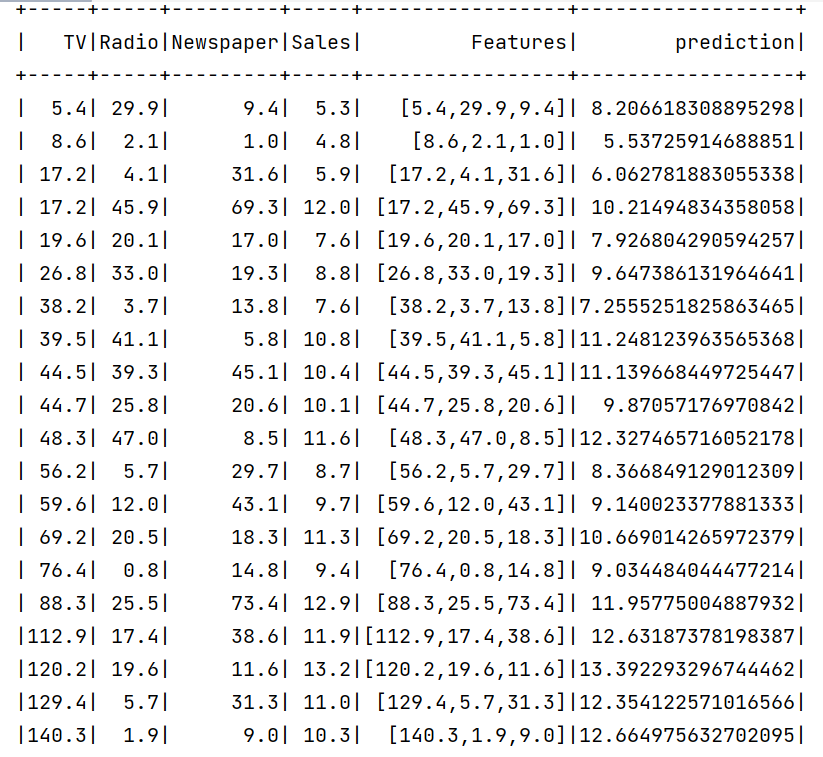

  # Spark MLIB
Apache Spark is a fast and general-purpose cluster computing system, and MLlib is its machine learning library. MLlib provides various tools for machine learning tasks such as classification, regression, clustering, collaborative filtering, and dimensionality reduction. 

## Exercise 1 
This Java class utilizes Apache Spark's MLlib library for linear regression on a dataset named "advertising.csv." It initializes a Spark session, reads the CSV file into a DataFrame, assembles feature vectors, and splits the data into training and test sets. The class then creates and trains a linear regression model using the training set, makes predictions on the test set, and displays the results, including the intercept and coefficients of the model.

```
 SparkSession ss= SparkSession.builder().appName("Tp spark ml").master("local[*]").getOrCreate();
        Dataset<Row> dataset =ss.read().option("inferSchema",true).option("header",true).csv("advertising.csv");
        VectorAssembler assembler=new VectorAssembler().setInputCols(new String[]{"TV","Radio","Newspaper"}
        ).setOutputCol("Features");
        Dataset<Row> assembledDS=assembler.transform(dataset);
        Dataset<Row> splits[]=assembledDS.randomSplit(new double[]{0.8,0.2},123);
        Dataset<Row> train=splits[0];
        Dataset<Row> test=splits[1];

        LinearRegression lr=new LinearRegression().setLabelCol("Sales").setFeaturesCol("Features");
        LinearRegressionModel model=lr.fit(train);
        Dataset<Row> prediction=model.transform(test);
        prediction.show();
        System.out.println("Intercept="+model.intercept()+" coeficients= "+model.coefficients());
```



## Exercise 2
This Java class utilizes Apache Spark's MLlib library to perform k-means clustering on the "Mall_Customers.csv" dataset. It begins by reading the data and assembling feature vectors for "Age," "Annual Income (k$)," and "Spending Score (1-100)." Subsequently, the features are normalized using MinMaxScaler, and k-means clustering with k=5 is applied. The results, including cluster predictions and evaluation score, are then displayed.

```
SparkSession ss= SparkSession.builder().appName("Tp spark ml").master("local[*]").getOrCreate();
        Dataset<Row> dataset =ss.read().option("inferSchema",true).option("header",true).csv("Mall_Customers.csv");
        VectorAssembler assembler=new VectorAssembler().setInputCols(new String[]{"Age","Annual Income (k$)","Spending Score (1-100)"}
        ).setOutputCol("features");
        Dataset<Row> assembledDataset = assembler.transform(dataset);
        MinMaxScaler scaler = new MinMaxScaler().setInputCol("features").setOutputCol("normalizeFeatures");
        Dataset<Row> normalizedDS = scaler.fit(assembledDataset).transform(assembledDataset);
        normalizedDS.printSchema();
        KMeans kMeans = new KMeans().setK(5).setSeed(123).setFeaturesCol("normalizeFeatures").setPredictionCol("prediction");
        KMeansModel model = kMeans.fit(normalizedDS);
        Dataset<Row> prediction = model.transform(normalizedDS);
        prediction.show(200);
        ClusteringEvaluator evaluator = new ClusteringEvaluator();
        double score = evaluator.evaluate(prediction);
        System.out.println(score);
```


<b>Score :</b>

